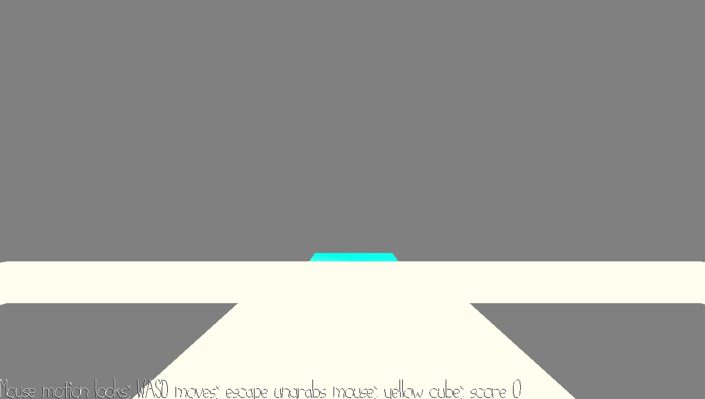

# Cube Walk

Author: Sarah Pethani

Design: Walk from cube to cube before the time runs out!

Screen Shot:

How To Play:

Move the player using the mouse and WASD. Text on the bottom of the screen displays the target cube, you must navigate to that color on the path. Your score is reset any time you fail to reach the target cube in time. Score is also displayed at the bottom.

Sources: Using [four-color.blend](scenes/four-color.blend), made by myself.

This game was built with [NEST](NEST.md).

